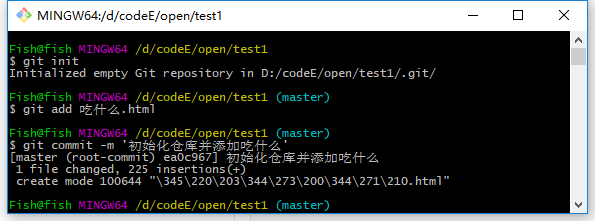

## 使用 git 管理本地代码

#### 1、安装git
#### 2、找到自己放代码的文件夹
#### 3、空白处右键选择Git Bash Here

#### 4、在Git Bash 中输入git init    （初始化，使此文件夹可以被git管理）
#### 5、在Git Bash 中输入git add xxx.xx    (将xxx.xx文件添加到暂存区)
#### 6、在Git Bash 中输入git commit -m 'xxx'    （将文件提交到本地仓库，xxx是提交备注）

#### 7、登录GitHub，创建一个仓库用来存放代码。

+ 点击new

+ 输入名字点完成即可。

#### 8、在Git Bash 中输入git remote add origin git@github.com:你的账号/刚刚在GitHub创建的仓库名.git

#### 9、在Git Bash 中输入git push -u origin master    （提交文件到远程服务器，第一次推送master分支，加上-u表示将远程和本地的master分支关联起来，方便以后推送或更新代码。）

#### 10、以后修改完代码在Git Bash中执行第5第6步，然后输入git push origin master即可将本地代码推送至GitHub服务器端。

